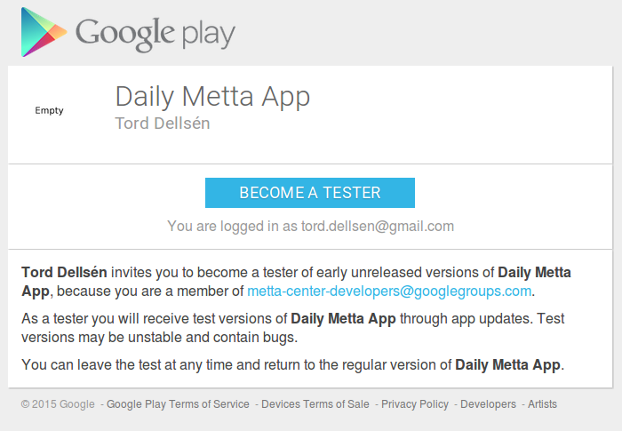

This document covers two ways to install testing versions of the Daily Metta App on a physical Android device


### Option 1: The recommended way
This is usually the best option. The app will automatically be updated when a new verion is uploaded on google play

1. Make sure your gmail address is part of our google group and log in to this gmail account (if you are not already logged in)

2. Go to https://play.google.com/apps/testing/org.mettacenter.dailymettaapp and click on "Become a tester"


3. Go to https://play.google.com/store/apps/details?id=org.mettacenter.dailymettaapp and install the app


### {DRAFT, review needed} Option 2: Installing using ADB (only for devs)
There is another alternative to install .apk files (the "executable" Android files generated when building) using adb (Android debug bridge) but this is a more complicated process. However if you are not logged into your own gmail account which is connected to this google group you may have to use adb to install the app. It can also be useful in other circumstances

1. Make sure that you have installed adb

2. Connect the physical device

3. Configures the connection to the physical device http://developer.android.com/tools/device.html

4. Get hold of the .apk file (probably that you have generated when building in Android Studio)

5. Type this: 
```adb install *path-to-apk-file*```
(Reference: http://developer.android.com/tools/help/adb.html#move)

