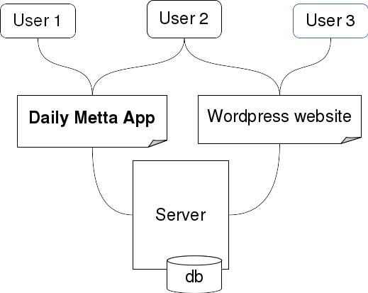

Reviewed by:
* Tord

***Not approved***

*For a more general ("high-level") understanding of where the information below fits into the requirements analysis and the software development process in general, please see [this article](http://en.wikipedia.org/wiki/Requirements_analysis)*.

<When editing this document, please do not remove the comments for each section which can be seen when editing (inside the lesser than and greater than signs), since these comments gives suggestions on how to write each section>

# Software Requirements Specification for the Daily Metta App

This document is based on a template with this copyright: "Copyright © 1999 by Karl E. Wiegers. Permission is granted to use, modify, and distribute this document."

### Revision History

See commit notes

## 1. Introduction

### 1.1 Purpose
<Identify the product whose software requirements are specified in this document, including the revision or release number. Describe the scope of the product that is covered by this SRS, particularly if this SRS describes only part of the system or a single subsystem.>

Software requirement specification (SRS) for Daily Metta App version 1.0

Deals with the Android platform which is what this whole project is about. (This document and project is not about iOS or the web platforms)

### 1.2 Document Conventions
<Describe any standards or typographical conventions that were followed when writing this SRS, such as fonts or highlighting that have special significance. For example, state whether priorities  for higher-level requirements are assumed to be inherited by detailed requirements, or whether every requirement statement is to have its own priority.>

* If a future version is discussed this will be explicitly mentioned in this document. Otherwise version 1.0 is implicitly assumed
* This document assumes that we are using the Android platform

### 1.3 Intended Audience and Reading Suggestions
<Describe the different types of reader that the document is intended for, such as developers, project managers, marketing staff, users, testers, and documentation writers. Describe what the rest of this SRS contains and how it is organized. Suggest a sequence for reading the document, beginning with the overview sections and proceeding through the sections that are most pertinent to each reader type.>

This document can be read by everyone. The technical requirements may use some tech/nerd speech, for help please see [Glossary and abbreviations](glossary-and-abbreviations.md)

### 1.4 Product Scope
<Provide a short description of the software being specified and its purpose, including relevant benefits, objectives, and goals. Relate the software to corporate goals or business strategies. If a separate vision and scope document is available, refer to it rather than duplicating its contents here.>

The Daily Metta App is a project to bring the [Daily Metta articles](http://mettacenter.org/category/daily-metta/) (from the Metta Center for Nonviolence) to the **Android** platform, increasing the **ease of access** for users.

#### Relation to the Metta Center Roadmap

In the future we wish to build a web app for the [Metta Center Roadmap](http://mettacenter.org/roadmap/) and we wish to be able to integrate these two apps with each other, possibly in these ways:
* Ability to search for tags
* Commitment and completion of an "Experiment in Nonviolence" that is found in the Daily Metta articles

### 1.5 References
<List any other documents or Web addresses to which this SRS refers. These may include user interface style guides, contracts, standards, system requirements specifications, use case documents, or a vision and scope document. Provide enough information so that the reader could access a copy of each reference, including title, author, version number, date, and source or location.>

* The Daily Metta articles can be found here: http://mettacenter.org/category/daily-metta/

## 2. Overall Description

### 2.1 Product Perspective
<Describe the context and origin of the product being specified in this SRS. For example, state whether this product is a follow-on member of a product family, a replacement for certain existing systems, or a new, self-contained product. If the SRS defines a component of a larger system, relate the requirements of the larger system to the functionality of this software and identify interfaces between the two. A simple diagram that shows the major components of the overall system, subsystem interconnections, and external interfaces can be helpful.>

**System overview:**

**Data structure:**

* Date
* Wisdom teacher
* Link to the article on the web
* Article text
  * Title
  * Quote
  * Main text
  * Experiment in Nonviolence
* *Excluded:* Any media seen on the web (images or videos)

### 2.2 Product Functions
<Summarize the major functions the product must perform or must let the user perform. Details will be provided in Section 3, so only a high level summary (such as a bullet list) is needed here. Organize the functions to make them understandable to any reader of the SRS. A picture of the major groups of related requirements and how they relate, such as a top level data flow diagram or object class diagram, is often effective.>

We want the user to be able to:
* Have offline access to Daily Metta articles
* Accessing the article on the web
* Get notifications for new Daily Mettas
* Find Daily Mettas by date
* Find Daily Mettas by doing text searches
* Share Daily Metta articles with other users

<
Low prio features for Android:
* Getting a random Daily Metta by pressing a Button
* Random Daily Metta in a widget
* Latest Daily Metta in a widget
* Tags downloaded from the web

Features that are better for a web app:
* Mark as favorite
* Marking an experiment in nonviolence as started (committed to doing)
* Marking an experiment in nonviolence as done
>

### 2.3 User Classes and Characteristics
<Identify the various user classes that you anticipate will use this product. User classes may be differentiated based on frequency of use, subset of product functions used, technical expertise, security or privilege levels, educational level, or experience. Describe the pertinent characteristics of each user class. Certain requirements may pertain only to certain user classes. Distinguish the most important user classes for this product from those who are less important to satisfy.>

User | Importance | Considerations
--- | --- | ---
Daily Metta User/Reader | High | Ease of access to software, ease of usage of the software itself, "counting screen-clicks"

### 2.4 Operating Environment
<Describe the environment in which the software will operate, including the hardware platform, operating system and versions, and any other software components or applications with which it must peacefully coexist.>

Min Android version: 4.0.3 (Ice Cream Sandwich)

### 2.5 Design and Implementation Constraints
<Describe any items or issues that will limit the options available to the developers. These might include: corporate or regulatory policies; hardware limitations (timing requirements, memory requirements); interfaces to other applications; specific technologies, tools, and databases to be used; parallel operations; language requirements; communications protocols; security considerations; design conventions or programming standards (for example, if the customer’s organization will be responsible for maintaining the delivered software).>

### 2.6 User Documentation
<List the user documentation components (such as user manuals, on-line help, and tutorials) that will be delivered along with the software. Identify any known user documentation delivery formats or standards.>

* The interface is expected to be intuitive enough to not require a manual
* If help is needed making a short video and putting in on Google Play may be best

#### 2.7 Assumptions and Dependencies
<List any assumed factors (as opposed to known facts) that could affect the requirements stated in the SRS. These could include third-party or commercial components that you plan to use, issues around the development or operating environment, or constraints. The project could be affected if these assumptions are incorrect, are not shared, or change. Also identify any dependencies the project has on external factors, such as software components that you intend to reuse from another project, unless they are already documented elsewhere (for example, in the vision and scope document or the project plan).>

Dependencies:
* Communication system with the server for fetching the Daily Metta articles
* Data structure of the Daily Metta articles

## 3. External Interface Requirements

#### 3.1 User Interfaces
<Describe the logical characteristics of each interface between the software product and the users. This may include sample screen images, any GUI standards or product family style guides that are to be followed, screen layout constraints, standard buttons and functions (e.g., help) that will appear on every screen, keyboard shortcuts, error message display standards, and so on. Define the software components for which a user interface is needed. Details of the user interface design should be documented in a separate user interface specification.>

* Search for text button
* Find by date button
* Sharing button
* Accessing the article on the web

#### 3.2 Hardware Interfaces
<Describe the logical and physical characteristics of each interface between the software product and the hardware components of the system. This may include the supported device types, the nature of the data and control interactions between the software and the hardware, and communication protocols to be used.>

* Android phones
  * Min Android version: 4.0.3 (Ice Cream Sandwich)
  * 320 px min width
* Will not be optimized for tablets, but it will be possible to run the app there as well

#### 3.3 Software Interfaces
<Describe the connections between this product and other specific software components (name and version), including databases, operating systems, tools, libraries, and integrated commercial components. Identify the data items or messages coming into the system and going out and describe the purpose of each. Describe the services needed and the nature of communications. Refer to documents that describe detailed application programming interface protocols. Identify data that will be shared across software components. If the data sharing mechanism must be implemented in a specific way (for example, use of a global data area in a multitasking operating system), specify this as an implementation constraint.>

We wish to make a connection in the future with a future Metta Center Roadmap app.

TBD: More to be added here

#### 3.4 Communications Interfaces
<Describe the requirements associated with any communications functions required by this product, including e-mail, web browser, network server communications protocols, electronic forms, and so on. Define any pertinent message formatting. Identify any communication standards that will be used, such as FTP or HTTP. Specify any communication security or encryption issues, data transfer rates, and synchronization mechanisms.>

A user needs an internet connection so that the articles can be downloaded, but the connection doesn't have to be persistent since the articles are stored on the device

## 4. System Features
<This template illustrates organizing the functional requirements for the product by system features, the major services provided by the product. You may prefer to organize this section by use case, mode of operation, user class, object class, functional hierarchy, or combinations of these, whatever makes the most logical sense for your product.>

#### 4.1 Automatic downloading of new Daily Metta articles
<State the feature name in just a few words.>

##### Description and Priority
<Provide a short description of the feature and indicate whether it is of High, Medium, or Low priority. You could also include specific priority component ratings, such as benefit, penalty, cost, and risk (each rated on a relative scale from a low of 1 to a high of 9).>

Description: Automatic downloading of Daily Metta articles, **excluding any media (images, videos)**, in other words downloading the text

Priority: High

##### Stimulus/Response Sequences
<List the sequences of user actions and system responses that stimulate the behavior defined for this feature. These will correspond to the dialog elements associated with use cases.>

Stimulus: Trigger in the app which occurs many times each day (for example once per hour)

Response: The app connects to the server and downloads the text

##### Functional Requirements
<Itemize the detailed functional requirements associated with this feature. These are the software capabilities that must be present in order for the user to carry out the services provided by the feature, or to execute the use case. Include how the product should respond to anticipated error conditions or invalid inputs. Requirements should be concise, complete, unambiguous, verifiable, and necessary. Use “TBD” as a placeholder to indicate when necessary information is not yet available.>

<Each requirement should be uniquely identified with a sequence number or a meaningful tag of some kind.>

* **COM-1:** App connects to remote server
* **COM-2:** App downloads text from remote server

#### 4.2 Notifiction when new Daily Metta has been downloaded
<State the feature name in just a few words.>

##### Description and Priority
<Provide a short description of the feature and indicate whether it is of High, Medium, or Low priority. You could also include specific priority component ratings, such as benefit, penalty, cost, and risk (each rated on a relative scale from a low of 1 to a high of 9).>

Description: We give the user a notification that a new Daily Metta has been downloaded

Priority: High

##### Stimulus/Response Sequences
<List the sequences of user actions and system responses that stimulate the behavior defined for this feature. These will correspond to the dialog elements associated with use cases.>

Stimulus: A new Daily Metta has been posted on the webpage and downloaded by the app

Response: An Android system notification is show to the user

##### Functional Requirements
<Itemize the detailed functional requirements associated with this feature. These are the software capabilities that must be present in order for the user to carry out the services provided by the feature, or to execute the use case. Include how the product should respond to anticipated error conditions or invalid inputs. Requirements should be concise, complete, unambiguous, verifiable, and necessary. Use "TBD" as a placeholder to indicate when necessary information is not yet available.>

<Each requirement should be uniquely identified with a sequence number or a meaningful tag of some kind.>

* **NTN-1:** App shows the user a notification

#### 4.3 Search by date
<State the feature name in just a few words.>

##### Description and Priority
<Provide a short description of the feature and indicate whether it is of High, Medium, or Low priority. You could also include specific priority component ratings, such as benefit, penalty, cost, and risk (each rated on a relative scale from a low of 1 to a high of 9).>

Description: The user can search through Daily Metta's by changing the date

Priority: High

##### Stimulus/Response Sequences
<List the sequences of user actions and system responses that stimulate the behavior defined for this feature. These will correspond to the dialog elements associated with use cases.>

##### Functional Requirements
<Itemize the detailed functional requirements associated with this feature. These are the software capabilities that must be present in order for the user to carry out the services provided by the feature, or to execute the use case. Include how the product should respond to anticipated error conditions or invalid inputs. Requirements should be concise, complete, unambiguous, verifiable, and necessary. Use "TBD" as a placeholder to indicate when necessary information is not yet available.>

<Each requirement should be uniquely identified with a sequence number or a meaningful tag of some kind.>

* **SCH-1:** The app stores dates for Daily Mettas
* **SCH-2:** The app presents the user with a interface for selecting the date

#### 4.4 Search by text
<State the feature name in just a few words.>

##### Description and Priority
<Provide a short description of the feature and indicate whether it is of High, Medium, or Low priority. You could also include specific priority component ratings, such as benefit, penalty, cost, and risk (each rated on a relative scale from a low of 1 to a high of 9).>

Description: The user can search through all Daily Metta texts and gets a list of zero or more hits

Priority: High

##### Stimulus/Response Sequences
<List the sequences of user actions and system responses that stimulate the behavior defined for this feature. These will correspond to the dialogue elements associated with use cases.>

##### Functional Requirements
<Itemize the detailed functional requirements associated with this feature. These are the software capabilities that must be present in order for the user to carry out the services provided by the feature, or to execute the use case. Include how the product should respond to anticipated error conditions or invalid inputs. Requirements should be concise, complete, unambiguous, verifiable, and necessary. Use "TBD" as a placeholder to indicate when necessary information is not yet available.>

<Each requirement should be uniquely identified with a sequence number or a meaningful tag of some kind.>

* **SCH-3:** The app stores all the text of the Daily Mettas
* **SCH-4:** The app presents the user with an interface for searching by entering text and pressing enter
* Optional: **SCH-5:** The app presents the user with an interface for searching where the results are dynamically updated

#### 4.5 Link to the article on the web
<State the feature name in just a few words.>

##### Description and Priority
<Provide a short description of the feature and indicate whether it is of High, Medium, or Low priority. You could also include specific priority component ratings, such as benefit, penalty, cost, and risk (each rated on a relative scale from a low of 1 to a high of 9).>

Description: The interface in the app contains a link to the article on the web

Priority: High

##### Stimulus/Response Sequences
<List the sequences of user actions and system responses that stimulate the behavior defined for this feature. These will correspond to the dialogue elements associated with use cases.>

##### Functional Requirements
<Itemize the detailed functional requirements associated with this feature. These are the software capabilities that must be present in order for the user to carry out the services provided by the feature, or to execute the use case. Include how the product should respond to anticipated error conditions or invalid inputs. Requirements should be concise, complete, unambiguous, verifiable, and necessary. Use "TBD" as a placeholder to indicate when necessary information is not yet available.>

<Each requirement should be uniquely identified with a sequence number or a meaningful tag of some kind.>

* **LNK-1:** The app has a link to the Daily Metta article on the web

#### 4.6 Sharing a Daily Metta
<State the feature name in just a few words.>

##### Description and Priority
<Provide a short description of the feature and indicate whether it is of High, Medium, or Low priority. You could also include specific priority component ratings, such as benefit, penalty, cost, and risk (each rated on a relative scale from a low of 1 to a high of 9).>

Description: A daily Metta article can be shared with others via the standard "Android sharing system"

Priority: Medium

##### Stimulus/Response Sequences
<List the sequences of user actions and system responses that stimulate the behavior defined for this feature. These will correspond to the dialogue elements associated with use cases.>

##### Functional Requirements
<Itemize the detailed functional requirements associated with this feature. These are the software capabilities that must be present in order for the user to carry out the services provided by the feature, or to execute the use case. Include how the product should respond to anticipated error conditions or invalid inputs. Requirements should be concise, complete, unambiguous, verifiable, and necessary. Use "TBD" as a placeholder to indicate when necessary information is not yet available.>

<Each requirement should be uniquely identified with a sequence number or a meaningful tag of some kind.>

* **SHR-1:** The app gives the user the opportunity to share Daily Metta articles

## 5. Other Nonfunctional Requirements

### 5.1 Performance Requirements
<If there are performance requirements for the product under various circumstances, state them here and explain their rationale, to help the developers understand the intent and make suitable design choices. Specify the timing relationships for real time systems. Make such requirements as specific as possible. You may need to state performance requirements for individual functional requirements or features.>

### 5.2 Safety Requirements
<Specify those requirements that are concerned with possible loss, damage, or harm that could result from the use of the product. Define any safeguards or actions that must be taken, as well as actions that must be prevented. Refer to any external policies or regulations that state safety issues that affect the product’s design or use. Define any safety certifications that must be satisfied.>

### 5.3 Security Requirements
<Specify any requirements regarding security or privacy issues surrounding use of the product or protection of the data used or created by the product. Define any user identity authentication requirements. Refer to any external policies or regulations containing security issues that affect the product. Define any security or privacy certifications that must be satisfied.>

### 5.4 Software Quality Attributes
<Specify any additional quality characteristics for the product that will be important to either the customers or the developers. Some to consider are: adaptability, availability, correctness, flexibility, interoperability, maintainability, portability, reliability, reusability, robustness, testability, and usability. Write these to be specific, quantitative, and verifiable when possible. At the least, clarify the relative preferences for various attributes, such as ease of use over ease of learning.>

TODO

### 5.5 Business Rules
<List any operating principles about the product, such as which individuals or roles can perform which functions under specific circumstances. These are not functional requirements in themselves, but they may imply certain functional requirements to enforce the rules.>

### 5.6 Other Requirements
<Define any other requirements not covered elsewhere in the SRS. This might include database requirements, internationalization requirements, legal requirements, reuse objectives for the project, and so on. Add any new sections that are pertinent to the project.>

In the future we may want to be able to connect this app to the roadmap app __________________

### Appendix A: Glossary
<Define all the terms necessary to properly interpret the SRS, including acronyms and abbreviations. You may wish to build a separate glossary that spans multiple projects or the entire organization, and just include terms specific to a single project in each SRS.>

See [Glossary and abbreviations](glossary-and-abbreviations.md)

### Appendix B: Analysis Models
<Optionally, include any pertinent analysis models, such as data flow diagrams, class diagrams, state-transition diagrams, or entity-relationship diagrams.>

### Appendix C: To Be Determined List
<Collect a numbered list of the TBD (to be determined) references that remain in the SRS so they can be tracked to closure.>
